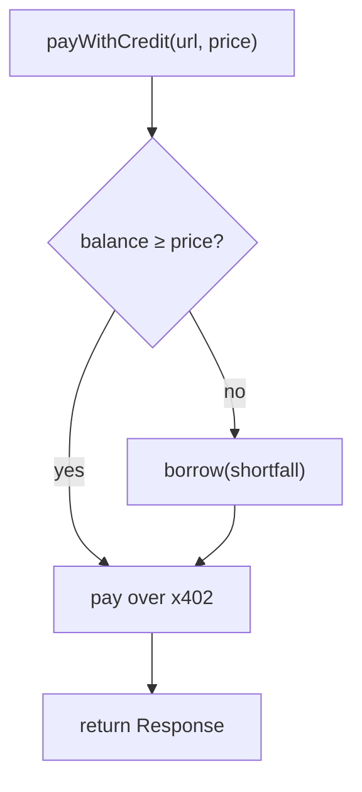

# SDK reference

`@fianza/agent-sdk` is the interface an AI agent uses to take and repay
revenue-underwritten credit on Fianza. The agent holds its own Stellar
key — every on-chain write is signed by that key, never by Fianza. Reads
are simulate-only (free, no transaction submitted). Scoring/underwriting
itself is delegated to the Fianza backend (the trusted underwriter in v1).

New to this? Read the [onboarding kit](onboarding-kit.md) first — it walks
through getting a testnet account funded before any of this will work.

## Install

```bash
npm install @fianza/agent-sdk
```

## Construct an agent

```ts
import { FianzaAgent } from "@fianza/agent-sdk";

const tl = new FianzaAgent(secret, {
  apiBaseUrl: "https://fianza-3ecj.onrender.com", // the underwriting engine
  rpcUrl: "https://soroban-testnet.stellar.org", // default: testnet
  networkPassphrase: "Test SDF Network ; September 2015", // default: testnet
  contracts: {           // optional — omit to auto-resolve from /config
    registry: "...",
    creditLine: "...",
    vault: "...",
  },
});
```

| Option | Required? | What it does |
|---|---|---|
| `secret` (constructor arg) | yes | Your agent's Stellar secret key. The SDK derives its keypair and public address from this. |
| `apiBaseUrl` | recommended | The Fianza underwriting API. Defaults to `http://localhost:8787` (local dev) — set this explicitly for testnet/production. |
| `rpcUrl` | no | Soroban RPC endpoint. Defaults to public testnet RPC. |
| `networkPassphrase` | no | Stellar network passphrase. Defaults to testnet. |
| `contracts` | no | Explicit contract IDs. If omitted, the SDK fetches them once from the backend's `/config` and caches them. |

## Function reference

### `publicKey()`

```ts
tl.publicKey(): string
```

Returns this agent's Stellar public address. Synchronous, no network call.

---

### `register()`

```ts
await tl.register(): Promise<TxResult>
```

Registers the agent in the on-chain `score_registry` (one-time — safe to
call again, it's idempotent on-chain). This is a **write**, signed and
submitted by the agent's own key. Returns `{ txHash, returnValue,
explorerUrl }`.

---

### `underwrite(opts?)`

```ts
await tl.underwrite({ skipProof?: boolean; fromLedger?: number }): Promise<UnderwritingResult>
```

Runs a full underwriting pass on the backend: indexes the agent's real
revenue, checks counterparty independence, optionally verifies an off-chain
zkTLS proof, computes a score, signs it, and publishes it to
`score_registry`. This is the call that actually determines your credit
limit and APR.

> **Important — don't borrow against `result.score.limitUsdc`.** That field
> is the **tier ceiling**: what this agent could draw with a perfect
> repayment track record. A brand-new agent's *actual* drawable limit is
> ramped down (starting at 15%, +15% per on-time repayment, -30% per miss —
> see [How the credit engine works §4.3](credit-engine.md#43-credit-ramp---a-cold-agent-cant-jump-straight-to-a-big-line)).
> The response also includes `result.score.rampedLimitUsdc`, which matches
> what the vault contract actually enforces — but the reliable way to check
> "how much can I borrow right now" is always **`creditLine()`** or
> **`availableCreditUsdc()`** below, since those read live from the contract
> instead of a point-in-time scoring snapshot.

- `skipProof: true` — skip the (slow, ~20-90s) zkTLS proof step and score on
  on-chain revenue only. Useful for a fast recheck after new on-chain
  payments land.
- `fromLedger` — an explicit ledger to start indexing from, if you know
  roughly when your agent's history begins (helps when the RPC's ~24h
  window would otherwise miss older payments).

Returns the full result object, including `score.score`, `score.tier`,
`score.limitUsdc`, `score.aprBps`, the independence breakdown per payer, and
the zkTLS proof result if one was attempted.

---

### `onboard(opts?)`

```ts
await tl.onboard({ skipProof?: boolean; fromLedger?: number }): Promise<{ register: TxResult; underwrite: UnderwritingResult }>
```

Convenience wrapper: `register()` then `underwrite()`. This is almost always
what you want for a brand-new agent.

---

### `creditLine()`

```ts
await tl.creditLine(): Promise<{ tier: number; limitUsdc: number; aprBps: number }>
```

Reads your **current, live, on-chain** credit terms directly from the
`credit_line` contract (a free simulated read, not the backend's cached
copy). `tier` is the contract's tier enum (`0` = Unrated). Use this to check
your terms without re-running a full underwrite.

---

### `availableCreditUsdc()`

```ts
await tl.availableCreditUsdc(): Promise<number>
```

Your **remaining drawable credit** right now — `limit − outstanding
principal`, read live from the vault. Check this before calling `borrow()`
to avoid a failed transaction.

---

### `vaultState()`

```ts
await tl.vaultState(): Promise<VaultState>
```

Full isolated-vault accounting for this agent:

```ts
interface VaultState {
  liquidityUsdc: number;       // USDC currently sitting in the vault, undeployed
  principalUsdc: number;       // your current outstanding principal
  amountOwedUsdc: number;      // principal + accrued interest owed right now
  totalAssetsUsdc: number;     // current liquidity + principal deployed (NOT cumulative deposits)
  yieldPoolUsdc: number;       // accumulated lender yield
  limitUsdc: number;           // your current credit limit
  aprBps: number;              // your current APR, in basis points
}
```

---

### `usdcBalanceUsdc()`

```ts
await tl.usdcBalanceUsdc(): Promise<number>
```

Your agent's **spendable USDC balance** (a live SAC `balance` read) — not
your credit line, your actual wallet balance.

---

### `borrow(usdc)`

```ts
await tl.borrow(usdc: number): Promise<TxResult>
```

Draws `usdc` against your credit line into your own wallet. A **write**,
signed by your key. Will revert on-chain if you request more than
`availableCreditUsdc()`.

---

### `repay(usdc)`

```ts
await tl.repay(usdc: number): Promise<TxResult>
```

Repays `usdc` — interest first (which funds the first-loss reserve and
lender yield), then principal. A **write**, signed by your key. On-time
repayment is what ramps your credit limit up over subsequent
`underwrite()` calls; see
[How the credit engine works §4.3](credit-engine.md#43-credit-ramp---a-cold-agent-cant-jump-straight-to-a-big-line).

---

### `deposit(agentAddress, usdc)`

```ts
await tl.deposit(agentAddress: string, usdc: number): Promise<TxResult>
```

**This is the lender action, not the borrower action** — the caller (this
keypair) supplies `usdc` of liquidity into `agentAddress`'s isolated vault
and is exposed only to that one agent's default risk. Included on the same
class because the SDK doesn't distinguish "roles" — any keypair can act as
either a borrower or a lender.

---

### `payWithCredit(url, priceUsdc, opts?)`

```ts
await tl.payWithCredit(
  url: string,
  priceUsdc: number,
  opts?: { maxDraw?: number; init?: RequestInit },
): Promise<Response>
```

**Draw-on-402** — the flagship convenience method. Pays for an x402-priced
resource, automatically borrowing any shortfall between your current USDC
balance and the price *before* making the request. The agent never
"decides to borrow" — it just transacts, and the credit line silently
covers what its cash can't.



- `priceUsdc` — the price of the resource, in USDC (you need to know this
  ahead of time; the SDK doesn't parse x402 challenge responses for you).
- `opts.maxDraw` — optional safety cap. If the shortfall would exceed this,
  throws instead of borrowing.
- `opts.init` — a normal `fetch` `RequestInit` (method, headers, body),
  forwarded to the actual paid request — e.g. `{ method: "POST", body:
  JSON.stringify(...) }`.

Returns the raw `Response` from the paid request.

```ts
// Pays up to 3 USDC for a resource, borrowing at most 5 USDC to cover it.
const res = await tl.payWithCredit("https://api.example.com/premium", 3, {
  maxDraw: 5,
});
const data = await res.json();
```

---

### `revenue(fromLedger?)`

```ts
await tl.revenue(fromLedger?: number): Promise<RevenueReport>
```

A cheap, read-only live index of your on-chain x402 revenue — useful for
checking what the underwriter will see *before* actually running a full
`underwrite()` pass.

## Types reference (quick index)

| Type | Shape |
|---|---|
| `FianzaContracts` | `{ registry, creditLine, vault }` — all Stellar contract IDs |
| `CreditTerms` | `{ tier, limitUsdc, aprBps }` |
| `VaultState` | see `vaultState()` above |
| `TxResult` | `{ txHash, returnValue, explorerUrl }` |

## Error handling

The SDK throws **typed errors** (all extending `FianzaError`), so you can
catch specific failures instead of string-matching messages:

| Error | Thrown when |
|---|---|
| `ValidationError` | Bad input — a non-positive/`NaN` amount, or a malformed Stellar address. Thrown **locally, before any network call**, so bad input never wastes an RPC round-trip or a failed on-chain tx. |
| `ApiError` | A call to the Fianza backend returned a non-2xx status (carries `.status`, `.method`, `.path`, `.body`). |
| `TxError` | An on-chain write failed to submit or confirm (carries `.contractMethod`, `.detail`). Includes the case where the vault rejects a `borrow` above your limit. |
| `MaxDrawExceededError` | `payWithCredit`'s shortfall would exceed the `maxDraw` cap you set (carries `.need`, `.maxDraw`). |

```ts
import { FianzaAgent, ValidationError, TxError } from "@fianza/agent-sdk";

try {
  await tl.borrow(amount);
} catch (e) {
  if (e instanceof ValidationError) { /* fix the input */ }
  else if (e instanceof TxError) { /* on-chain rejected — e.g. over limit */ }
  else throw e;
}
```

The pure helpers `toStroops`, `fromStroops`, `isValidStellarAddress`, and
`creditShortfallUsdc` are also exported if you want to reuse the SDK's
conversion/validation logic directly.

## A complete, runnable example

See [`packages/agent-sdk/examples/quickstart.mjs`](../packages/agent-sdk/examples/quickstart.mjs)
for a full script that funds a fresh testnet agent and runs
register → underwrite → borrow → repay end to end, with real captured
output in the [onboarding kit](onboarding-kit.md).
