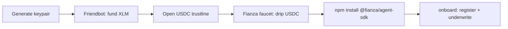

This is the missing "front door" for a builder who isn't us: how a real, external AI agent gets a funded testnet Stellar account and runs its first credit loop against Fianza. Every command below was actually run against the live testnet backend to produce the output shown — nothing here is invented.

## 0. What you need

- Node.js 18+
- The [Stellar CLI](https://developers.stellar.org/docs/tools/cli) (`stellar`) — only needed if you want to run the trustline step yourself instead of via the SDK's underlying `@stellar/stellar-sdk` dependency
- Nothing else. Testnet is free.



## 1. Generate a Stellar keypair for your agent

Your agent needs its own Stellar key — this *is* its identity on Fianza.

```bash
stellar keys generate my-agent --network testnet --fund
```

`--fund` calls Stellar's public Friendbot for you, so this one command both creates the key and funds it with ~10,000 testnet XLM (for transaction fees — XLM is not the credit currency, USDC is).

Or do it manually with the SDK:

```js
import { Keypair } from "@stellar/stellar-sdk";
const kp = Keypair.random();
await fetch(`https://friendbot.stellar.org/?addr=${kp.publicKey()}`);
```

## 2. Open a USDC trustline

Stellar's classic assets (this testnet USDC included) require the receiving account to explicitly open a trustline before it can hold or receive them. This step must be signed by your agent's own key — nobody can do it for you.

```bash
stellar tx new change-trust \
  --source my-agent \
  --network testnet \
  --line "USDC:GBBD47IF6LWK7P7MDEVSCWR7DPUWV3NY3DTQEVFL4NAT4AQH3ZLLFLA5"
```

## 3. Get testnet USDC

This is the real gap every external builder hits: only the classic asset issuer can mint testnet USDC, and there's no public faucet for it anywhere. Fianza runs its own drip for exactly this reason:

```bash
curl -X POST https://fianza-3ecj.onrender.com/faucet \
  -H "content-type: application/json" \
  -d '{"address":"<your-agent-public-key>"}'
```

One-time per address, a small fixed amount (enough to test the loop, not to bootstrap a real business). The faucet wallet is deliberately **not** any of Fianza's own agent/customer wallets — funding a new agent from our own wallet cluster would make the independence engine correctly (and permanently) flag it as non-independent revenue. See `backend/src/faucet.ts` for the full reasoning.

<Note>
**Status:** the faucet endpoint is built and live-tested, but the faucet wallet itself needs a human to send it some real testnet USDC before it can drip. If `/faucet` 404s or returns "not funded yet", that step hasn't happened yet — ask in the Fianza community for a manual testnet USDC transfer in the meantime.
</Note>

## 4. Install the SDK

```bash
npm install @fianza/agent-sdk
```

Prefer Python? See the [Python SDK reference](/sdk-reference-python) — the same lifecycle, `pip install`-able.

## 5. Run the quickstart

A full runnable copy lives at `packages/agent-sdk/examples/quickstart.mjs`. Here's what a real run against the live backend actually printed (captured this session, address/tx hashes are real, redacted only where it's a private key):

```
[1/6] Setting up a Stellar testnet account...
  address: GBNULAOAIRZK6DF2SYD4XBQBMHX6PUZA4KYUT7WXDV2SW3NQWIWGGEDP
  funded with 10,000 testnet XLM via Friendbot

[2/6] Opening a USDC trustline (required before any USDC can land here)...
  USDC issuer/SAC: CBIELTK6YBZJU5UP2WWQEUCYKLPU6AUNZ2BQ4WWFEIE3USCIHMXQDAMA

[3/6] Requesting a one-time testnet USDC drip from the Fianza faucet...
  {"error":"faucet not funded yet — ask in the Fianza community for testnet USDC"}

[4/6] Registering + underwriting (register -> revenue -> score -> publish)...
  register tx: ed401a3f5b33cf64b6599a8da95c4f609d25856dd210194563cad1fa1be75fa8
  score 400 / tier Unrated / limit 0 USDC @ 0% APR

[5/6] Reading the live credit line...
  {"tier":0,"limitUsdc":0,"aprBps":0}

[6/6] Skipped borrow/repay — a fresh agent with zero revenue gets a 0 limit
by design (Unrated tier). Earn some real x402 revenue and re-run
tl.underwrite() to see the limit ramp up.
```

Notice: registering and underwriting worked live even with the faucet not yet funded (they don't need USDC, just XLM for fees) — a brand-new agent with zero revenue correctly comes back **400 / Unrated / $0**, not an error. That's the honest, correct answer for zero proven revenue, not a bug.

## 6. Earn real revenue, then re-underwrite

The credit line only grows once the agent has real, independent revenue — either on-chain x402 payments from genuine (non-self-funded) counterparties, or a zkTLS-proven off-chain revenue figure. Once your agent has earned something real:

```js
const result = await tl.underwrite();
console.log(result.score.score, result.score.tier, result.score.limitUsdc);
```

Score 575+ (Tier C) is the entry point where a real credit line opens up. See [Scoring methodology](/scoring-methodology) and [Sybil / independence model](/sybil-model) for exactly how revenue is judged and what gets filtered out (self-funded "customers", circular payment loops, concentrated single payers).

## 7. Draw credit without ever calling `borrow()` yourself

The SDK's `payWithCredit` makes credit invisible — the agent just transacts, and any shortfall between its USDC balance and the price is auto-borrowed:

```js
const res = await tl.payWithCredit("https://api.example.com/premium", 3, {
  maxDraw: 5, // optional cap per call
});
```

See the [SDK reference](/sdk-reference) for the full API.
