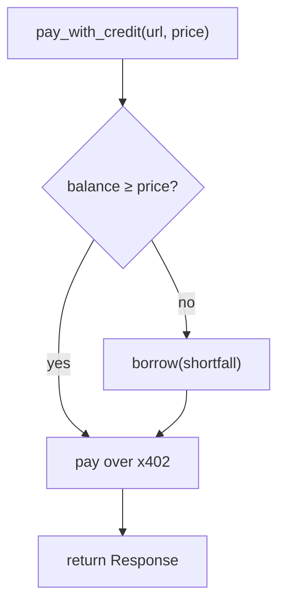

`fianza-agent-sdk` is the Python interface an AI agent uses to take and repay revenue-underwritten credit on Fianza. It is a faithful port of the [JavaScript/TypeScript SDK](/sdk-reference) — same lifecycle, same on-chain contracts, same backend underwriter. The agent holds its own Stellar key; on-chain writes (`register`/`borrow`/`repay`/`deposit`) are signed by that key. Reads (`credit_line`/`vault_state`) are simulate-only. Scoring/underwriting is delegated to the Fianza backend (the trusted underwriter, v1).

<Tip>
New to Fianza? Read the [onboarding kit](/onboarding-kit) first — it walks through funding a testnet account (the same prerequisites apply regardless of SDK language).
</Tip>

## Install

```bash
pip install fianza-agent-sdk
```

The package installs as the `fianza` module and depends on `stellar-sdk` and `requests`.

## Construct an agent

```python
from fianza import FianzaAgent

tl = FianzaAgent(
    secret,                                              # your agent's Stellar secret key
    api_base_url="https://fianza-5m68.onrender.com",  # the underwriting engine
    rpc_url="https://soroban-testnet.stellar.org",       # default: testnet
    network_passphrase="Test SDF Network ; September 2015",  # default: testnet
    contracts={                                          # optional — omit to auto-resolve from /config
        "registry": "...",
        "creditLine": "...",
        "vault": "...",
    },
)
```

| Argument | Required? | What it does |
|---|---|---|
| `secret` (positional) | yes | Your agent's Stellar secret key. The keypair and public address are derived from it. |
| `api_base_url` | recommended | The Fianza underwriting API. Defaults to `http://localhost:8787` (local dev) — set this explicitly for testnet. |
| `rpc_url` | no | Soroban RPC endpoint. Defaults to public testnet RPC (`TESTNET_RPC`). |
| `network_passphrase` | no | Stellar network passphrase. Defaults to testnet (`TESTNET_PASSPHRASE`). |
| `contracts` | no | Explicit contract IDs (`registry`, `creditLine`, `vault`). If omitted, resolved once from the backend's `/config` and cached. |
| `session` | no | A `requests.Session` to reuse for backend HTTP calls. |

## The full loop at a glance

```python
from fianza import FianzaAgent

tl = FianzaAgent(secret, api_base_url="https://fianza-5m68.onrender.com")
tl.register()                       # one-time on-chain registration
tl.underwrite()                     # backend scores + publishes on-chain
terms = tl.credit_line()            # read live tier / limit / APR
tl.borrow(5)                        # draw 5 USDC
# ... agent does its work ...
tl.repay(5)                         # repay — ramps the limit up next underwrite
```

## Function reference

### `public_key()`

```python
tl.public_key() -> str
```

Returns this agent's Stellar public address. No network call.

---

### `register()`

```python
tl.register() -> TxResult
```

Registers the agent in the on-chain `score_registry` (one-time, idempotent on-chain). A **write**, signed and submitted by the agent's own key. Returns a `TxResult` (`tx_hash`, `return_value`, `explorer_url`).

---

### `underwrite(skip_proof=False, from_ledger=None)`

```python
tl.underwrite(*, skip_proof: bool = False, from_ledger: int | None = None) -> Any
```

Runs a full underwriting pass on the backend: indexes real revenue, checks counterparty independence, optionally verifies an off-chain zkTLS proof, computes a score, signs it, and publishes it to `score_registry`. This is the call that determines your credit limit and APR. Returns the backend's full underwriting result (score, tier, limit, APR, per-payer independence breakdown, zkTLS result if attempted).

<Warning>
Don't borrow against the raw `limitUsdc` in the result — that's the **tier ceiling**, not what a cold agent can actually draw. The real drawable amount is ramped (see [How the credit engine works §4.3](/credit-engine#43-credit-ramp-a-cold-agent-cant-jump-straight-to-a-big-line)). Always check `available_credit_usdc()` or `credit_line()` for the live number.
</Warning>

- `skip_proof=True` — skip the slow (~20–90s) zkTLS proof step; score on on-chain revenue only.
- `from_ledger` — explicit ledger to start indexing from, for history older than the RPC's ~24h window.

---

### `onboard(skip_proof=False, from_ledger=None)`

```python
tl.onboard(*, skip_proof: bool = False, from_ledger: int | None = None) -> dict
```

Convenience wrapper: `register()` then `underwrite()`. Returns `{"register": TxResult, "underwrite": <result>}`. Almost always what you want for a brand-new agent.

---

### `credit_line()`

```python
tl.credit_line() -> CreditTerms
```

Reads your **current, live, on-chain** credit terms directly from the `credit_line` contract (a free simulated read). Returns a `CreditTerms` dataclass:

```python
@dataclass
class CreditTerms:
    tier: int        # contract tier enum (0 = Unrated)
    limit_usdc: float
    apr_bps: int
```

---

### `available_credit_usdc()`

```python
tl.available_credit_usdc() -> float
```

Your **remaining drawable credit** right now — `limit − outstanding principal`, read live from the vault. Check this before `borrow()` to avoid a failed transaction. Returns `0.0` if nothing is available.

---

### `vault_state()`

```python
tl.vault_state() -> VaultState
```

Full isolated-vault accounting for this agent:

```python
@dataclass
class VaultState:
    liquidity_usdc: float     # USDC in the vault, undeployed
    principal_usdc: float     # current outstanding principal
    amount_owed_usdc: float   # principal + accrued interest owed now
    total_assets_usdc: float  # liquidity + principal deployed (reserve excluded)
    yield_pool_usdc: float    # accumulated lender yield
    limit_usdc: float         # current credit limit
    apr_bps: int              # current APR, basis points
```

---

### `usdc_balance_usdc()`

```python
tl.usdc_balance_usdc() -> float
```

Your agent's **spendable USDC balance** (a live SAC `balance` read) — the actual wallet balance, not the credit line.

---

### `revenue(from_ledger=None)`

```python
tl.revenue(from_ledger: int | None = None) -> Any
```

A cheap, read-only live index of your on-chain x402 revenue — check what the underwriter will see *before* running a full `underwrite()`.

---

### `borrow(usdc)`

```python
tl.borrow(usdc: float) -> TxResult
```

Draws `usdc` against your credit line into your own wallet. A **write**, signed by your key. Raises `TxError` if the vault rejects the draw (e.g. over your limit); raises `ValidationError` locally for a non-positive amount before any network call.

---

### `repay(usdc)`

```python
tl.repay(usdc: float) -> TxResult
```

Repays `usdc` — interest first (funding the first-loss reserve and lender yield), then principal. A **write**, signed by your key. On-time repayment ramps your limit up on subsequent `underwrite()` calls.

---

### `deposit(agent_address, usdc)`

```python
tl.deposit(agent_address: str, usdc: float) -> TxResult
```

**The lender action, not the borrower action** — the caller (this keypair) supplies `usdc` of liquidity into `agent_address`'s isolated vault, exposed only to that one agent's default risk. Any keypair can act as borrower or lender.

---

### `pay_with_credit(url, price_usdc, ...)`

```python
tl.pay_with_credit(
    url: str,
    price_usdc: float,
    *,
    max_draw: float | None = None,
    method: str = "GET",
    headers: Mapping[str, str] | None = None,
    data: Any = None,
    json_body: Any = None,
    rpc_config: Mapping[str, str] | None = None,
    timeout: float | None = None,
) -> requests.Response
```

**Draw-on-402** — the flagship convenience method. Pays for an x402-priced resource, automatically borrowing any shortfall between your current USDC balance and the price *before* making the request. The agent never "decides to borrow" — it just transacts, and the credit line silently covers what its cash can't. Returns the final `requests.Response`.



- `price_usdc` — the resource price in USDC (you know what you're buying; the SDK doesn't parse the x402 challenge for you).
- `max_draw` — optional cap on how much credit a single call may draw. If the shortfall would exceed it, raises `MaxDrawExceededError`.
- `method` / `headers` / `data` / `json_body` — forwarded to the actual paid request (e.g. `method="POST", json_body={...}`).

```python
res = tl.pay_with_credit("https://api.example.com/premium", 3, max_draw=5)
data = res.json()
```

## Errors

All SDK errors extend `FianzaError`, so you can catch specific failures instead of string-matching:

| Error | Raised when |
|---|---|
| `ValidationError` | Bad input — non-positive amount or malformed Stellar address. Raised **locally, before any network call**. |
| `ApiError` | A backend call returned a non-2xx status (carries `status`, `method`, `path`, `body`). |
| `TxError` | An on-chain write failed to submit/confirm, or a read simulation failed (carries the contract method + detail). Includes the vault rejecting a `borrow` over-limit. |
| `MaxDrawExceededError` | `pay_with_credit`'s shortfall would exceed the `max_draw` cap. |

```python
from fianza import FianzaAgent, ValidationError, TxError

try:
    tl.borrow(amount)
except ValidationError:
    ...  # fix the input
except TxError:
    ...  # on-chain rejected — e.g. over limit
```

## Exported helpers & constants

The pure helpers `to_stroops`, `from_stroops`, `is_valid_stellar_address`, and `credit_shortfall_usdc` are exported for reuse, along with the constants `TESTNET_PASSPHRASE` and `TESTNET_RPC`.

## A complete, runnable example

See `packages/agent-sdk-py/examples/quickstart.py` for a full script that funds a fresh testnet agent and runs the register → underwrite → borrow → repay loop end to end.

## Build with Claude — the Fianza skill

If you use [Claude Code](https://claude.com/claude-code), there's an official **`fianza-agent-sdk` skill** that teaches Claude to drive this SDK (both Python and JS/TS): the full lifecycle, draw-on-402, error handling, and the common pitfalls. Install it any of these ways:

<CodeGroup>
```bash npx (one command)
npx @fianza/skill
```

```bash curl (no npm)
mkdir -p ~/.claude/skills/fianza-agent-sdk && \
  curl -fsSL https://raw.githubusercontent.com/TechnicallyKiller/Fianza/main/.claude/skills/fianza-agent-sdk/SKILL.md \
  -o ~/.claude/skills/fianza-agent-sdk/SKILL.md
```

```bash plugin
# in Claude Code:
/plugin marketplace add TechnicallyKiller/Fianza
/plugin install fianza-agent-sdk@fianza
```
</CodeGroup>

Then restart Claude Code (or run `/reload`) and invoke it with `/fianza-agent-sdk`. If you clone the repo, the skill is already present (it lives in `.claude/skills/`) — no install needed.

See the [Claude Code skill](/claude-skill) page for what the skill covers and how it stays in sync with the SDK.
